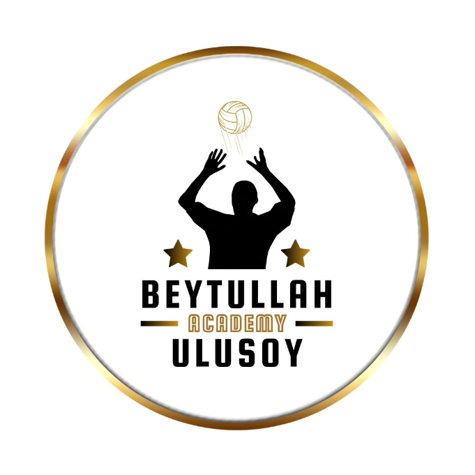

  
  <h3 align="center">beytullahulusoy - academy
</h3>
  

    <!-- PROJECT_DESCRIPTION -->
    <!--  
    <a href="https://github.com/kodlamaio-projects/nArchitecture"><strong>Explore the docs »</strong></a>
      -->
    <!--  
    <a href="https://github.com/kodlamaio-projects/nArchitecture">View Demo</a>
    · -->
    <a href="https://www.instagram.com/beytullahulusoyacademy/">Instagram</a>
    ·
    <a href="https://www.instagram.com/b_ulusoy11/">Beytullah Ulusoy</a>
  

## 💻 PROJE HAKKINDA

BEYTULLAH ULUSOY ACADEMY
⭐Bireysel ve grup halinde antrenmanlar
⭐Temel,ileri düzey teknik ve taktik eğitimi
⭐Koordinatif,atletik,kondisyonel beceri eğitimi

## ⚖️ License

Distributed under the MIT License. See `LICENSE` for more information.

## 📧 Contact

**Project Link:** [https://github.com/ahmetcdevelopment/beytullahulusoy-academy](https://github.com/ahmetcdevelopment/beytullahulusoy-academy)

<!-- ## 🙏 Acknowledgements
-  -->